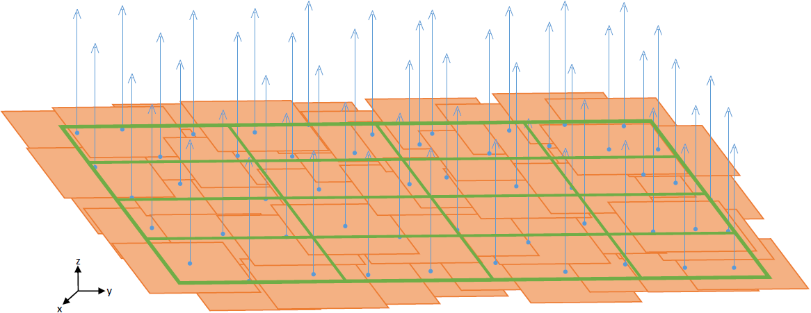

# pymicmac

This software is a result of the Netherlands eScience Center project [Improving Open-Source Photogrammetric Workflows for Processing Big Datasets](https://www.esciencecenter.nl/project/improving-open-source-photogrammetric-workflows-for-processing-big-datasets). 

`pymicmac` provides a Python interface for `MicMac` workflows execution and distributed computing tools for `MicMac`. 
[`MicMac`](http://micmac.ensg.eu) is a photogrammetric suite which contains many different tools to execute photogrammetric workflows.

In short, a photogrammetric workflow contains at least:

 - **Tie-points detection.** First,  key  features  in  the  images  are  extracted.   This  is  done
for example with the [SIFT algorithm](https://www.cs.ubc.ca/~lowe/papers/ijcv04.pdf).  Second, the key features are cross-matched
between different images to detect points corresponding to the same physical
locations and that are visible in different images.  The detected points are called tie-points
(they are also referred to as homologous points in related literature).

 - **Bundle block adjustment.** The camera positions and orientations are estimated and the parameters calibrated.

 - **Dense image matching.** The detected tie-points are matched and 3D projected to produce the dense point cloud. The 3D points are back projected in the images to correct for projective deformation. This creates a metrically correct True-orthophoto.

The MicMac suite contains several tools dedicated to each of the steps of the programmatic worflow. The tie-point detection is done with `Tapioca`, the bundle block adjustment is done with `Tapas` and the dense matching and point cloud generation is done with `Malt`, `Tawny` and `Nuage2Ply`.

 `pymicmac` addresses two main issues with `MicMac`:

1 `pymicmac` helps you when running a sequence of `MicMac` commands. The sequence of commands is defined in an XML. During execution `pymicmac` creates isolated execution folders separating the input data from the intermediates and the output data. `pymicmac` also adds CPU/MEM monitoring for the commands.

2 `pymicmac` contains distributed computing versions of `Tapioca` and of the matching pipeline (`Malt`, `Tawny`, `Nuage2Ply`). This allows running `Tapioca` and the matching pipeline in distributed systems such as SGE clusters or a bunch of ssh-reachable machines.

The `micmac-run-workflow` tool uses the sequential commands execution tool of [`pycoeman`](https://github.com/NLeSC/pycoeman). Detailed information is provided in the [Instructions](#instructions) section.

In section [Large image sets](#large-image-sets) we provide some tips on how to use `MicMac` and `pymicmac` for processing large image sets using distributed computing for the tie-points extraction and the dense image matching, and tie-points reduction for the bundle block adjustment.

A step-by-step tutorial is also available in [Tutorial](https://github.com/ImproPhoto/pymicmac/tree/master/docs/TUTORIAL.md).

## Installation

Clone this repository and install it with pip (using a virtualenv is recommended):

```
git clone https://github.com/ImproPhoto/pymicmac
cd pymicmac
pip install .
```

or install directly with:
 
```
pip install git+https://github.com/ImproPhoto/pymicmac
```

Python dependencies: `pycoeman` and `noodles` (see https://github.com/NLeSC/pycoeman and https://github.com/NLeSC/noodles for installation instructions)

Other Python  dependencies (numpy, tabulate, matplotlib, lxml) are automatically installed by `pip install .` but some system libraries have to be installed (for example freetype is required by matplotlib and may need to be installed by the system admin)

For now `pymicmac` works only in Linux systems. Requires Python 3.5.

## Instructions

The tool `micmac-run-workflow` is used to execute entire photogrammetric workflows with MicMac or portions of it. We recommend splitting the workflow in three pieces: tie-points extraction, bundle block adjustment and dense image matching. Each time the tool is executed, it creates an independent execution folder to isolate the processing from the input data. The tool can be executed as a python script (see example in `tests/run_workflow_test.sh`) or can be imported as a python module (see examples in `tests/run_tiepoint_detection_example.py`, `tests/run_param_estimation_example.py` and `tests/run_matching_example.py`). Which `MicMac` commands are executed is specified with an XML configuration file.

### Workflow XML configuration file

The Workflow XML configuration file format is the sequential commands XML configuration file format used by [`pycoeman`](https://github.com/NLeSC/pycoeman). For `pymicmac`, usually the first tool in any Workflow XML configuration file links to the list of images. So, we can use `<requirelist>` to specify a file with the list of images. Next, some XML examples:

- tie-points extraction:
```
<SeqCommands>
  <Component>
    <id> Tapioca </id>
    <requirelist>list.txt</requirelist>
    <command> mm3d Tapioca All ".*jpg" -1 </command>
  </Component>
</SeqCommands>
```

- Bundle block adjustment
```
<SeqCommands>
  <Component>
    <id> Tapas </id>
    <requirelist>list.txt</requirelist>
    <require>tie-point-detection/Homol</require>
    <command> mm3d Tapas Fraser ".*jpg" Out=TapasOut </command>
  </Component>
</SeqCommands>
```

- Dense image matching:
```
<SeqCommands>
  <Component>
    <id> Malt </id>
    <requirelist>list.txt</requirelist>
    <require> param-estimation/Ori-TapasOut</require>
    <command> mm3d Malt GeomImage ".*jpg" TapasOut "Master=1.jpg" "DirMEC=Results" UseTA=1 ZoomF=1 ZoomI=32 Purge=true </command>
  </Component>
  <Component>
    <id> Nuage2Ply </id>
    <command> mm3d Nuage2Ply "./Results/NuageImProf_STD-MALT_Etape_8.xml" Attr="1.jpg" Out=1.ply</command>
  </Component>
</SeqCommands>
```

Following the examples above, we could execute a whole photogrammetric workflow with:
```
micmac-run-workflow -d /path/to/data -e tie-point-detection -c tie-point-detection.xml
micmac-run-workflow -d /path/to/data -e param-estimation -c param-estimation.xml
micmac-run-workflow -d /path/to/data -e matching -c matching.xml
```

*NOTE*: all file and folder names, specified in `<require>` and `<requirelist>` must be provided relative to the folder where all the data is - `/path/to/data`. 

### Monitoring

The tool used by `pymicmac` to run the commands, `pycoeman` keeps the log produced by each command in a .log file. Additionally, it stores a .mon and a .mon.disk with the CPU/MEM/disk monitoring. There are `pycoeman` tools for calculating statistics and creating plots for monitoring (see https://github.com/NLeSC/pycoeman). There are some tools in `pymicmac` to analyze the logs of several `MicMac` commands: `micmac-tapas-log-anal`, `micmac-redtiep-log-anal`, `micmac-redtiep-log-anal`, `micmac-campari-log-anal`, `micmac-gcpbascule-log-anal`, `micmac-gcpbascule-log-plot`, `micmac-campari-log-plot` (the MicMac command if part of the tool name).

## Large image sets

For the tie-points extraction and dense image matching the processing can be easily enhanced by using distributed computing (clusters or clouds). The reason is that the processes involved can be easily split in independent chunks (in each chunk one or more images are processed). For the bundle block adjustment, this is not the case since the involved processes usually require having data from all the images simultaneously in memory. In this case, we propose to use tie-points reduction to deal with large image sets.

For more information about distributed computing and tie-points reduction, see our paper: Martinez-Rubi, Oscar, Francesco Nex, Marc Pierrot-Deseilligny, and Ewelina Rupnik. “Improving FOSS Photogrammetric Workflows for Processing Large Image Datasets.” Open Geospatial Data, Software and Standards 2 (May 15, 2017): 12. [https://doi.org/10.1186/s40965-017-0024-5.](https://doi.org/10.1186/s40965-017-0024-5).

### Distributed computing

Some steps of the photogrammetric workflow, namely the tie-points extraction and the dense image matching, can be executed more efficiently on distributed computing systems exploiting the innate data parallelism in photogrametry. 

For example, the `Tapioca` tool (tie-points extraction) first extracts the features for each image and then cross-matches the features between image pairs. The proposed distributed computing solution divides the list of all image pairs in chunks where each chunk can be processed mostly independently. At the end of the results from each chunk processing need to be combined.

We use the parallel commands execution tools of `pycoeman`. The various parallel/distributed commands are specified in an XML configuration file which is similar to the Workflow XML configuration file. An example XML configuration, where the `Tapioca` processes two data chunks, each containing half of the image pairs:

```
<ParCommands>
  <Component>
    <id>0_Tapioca</id>
    <requirelist>DistributedTapioca/0_ImagePairs.xml.list</requirelist>
    <require>DistributedTapioca/0_ImagePairs.xml</require>
    <command>mm3d Tapioca File 0_ImagePairs.xml -1</command>
    <output>Homol</output>
  </Component>
  <Component>
    <id>1_Tapioca</id>
    <requirelist>DistributedTapioca/1_ImagePairs.xml.list</requirelist>
    <require>DistributedTapioca/1_ImagePairs.xml</require>
    <command>mm3d Tapioca File 1_ImagePairs.xml -1</command>
    <output>Homol</output>
  </Component>
</ParCommands>
```

The `pycoeman` tool `coeman-mon-plot-cpu-mem` can be used to get a plot of the aggregated CPU and MEM usage.

#### Distributed MicMac Tools

##### Tapioca

The tools `micmac-disttapioca-create-pairs`, `micmac-disttapioca-create-config`, `micmac-disttapioca-combine` together with the parallel commands execution tools of `pycoeman` are used to run `Tapioca` on distributed computing systems.

In order to run `Tapioca` on a distributed system, a list containing image pairs is needed. The `micmac-disttapioca-create-pairs` tool creates such a list. The `micmac-disttapioca-create-config` tool splits the image pairs XML file in multiple chunks and creates an XML configuration file compatible with `pycoeman`:

```
micmac-disttapioca-create-config -i [input XML image pairs] -f [folder for output XMLs and file lists, one for each chunk] -n [number of image pairs per output XML, must be even number] -o [XML configuration file]
```

Next, the distributed tool can be executed on any hardware system supporting `pycoeman` (see https://github.com/NLeSC/pycoeman) using the `coeman-par-local`, `coeman-par-ssh` or `coeman-par-sge` tools.

After the distributed `Tapioca` has finished, the outputs from the different chunks need to be combined. The `micmac-disttapioca-combine` tool combines all outputs in a final Homol folder:

```
micmac-disttapioca-combine -i [folder with subfolders, each subfolder with the results of the processing of a chunk] -o [output combined folder]
```

##### Matching (Malt, Tawny, Nuage2Ply)

To generate the final point cloud on a distributed computing system, the dense point matching is parallelized by `micmac-distmatching-create-config` and the parallel commands execution tool of `pycoeman`.

The algorithm in `micmac-distmatching-create-config` is restricted to aerial images when the camera orientation obtained in the parameter estimation step of the photogrammetric workflow is in a cartographic reference system. From the estimated camera positions and assuming that the Z direction (along which the pictures were taken) is always pointing to the ground, the tool computes the XY bounding box that includes all the XY camera positions. The bounding box is divided in tiles like shown in the figure below:



Each tile can be then processed by an independent process. For each tile the images intersecting their XY position with the tile are used. If needed this set of images is extended by the nearest neighbours to guarantee a minimum of 6 images per tile.

The `micmac-distmatching-create-config` generates the tiles from the initial large list of imagesand creates an XML configuration file suitable for `pycoeman`:

```
micmac-distmatching-create-config -i [orientation folder] -t [Homol folder] -e [images format] -o [XML configuration file] -f [folder for extra tiles information] -n [number of tiles in x and y]
```

Next, the distributed tool can be executed on any hardware systems supported by `pycoeman` (see https://github.com/NLeSC/pycoeman). The  `coeman-par-local`, `coeman-par-ssh` or `coeman-par-sge` tools are used for this purpose.

### Tie-points reduction

For more efficient workflow execution, we propose to perform a tie-points reduction step before the bundle adjustment. This extra step is added to the processing chain of the parameters estimation step. For detailed explanation, please refer to the Tie-point reduction section in this [report](http://knowledge.esciencecenter.nl/content/report-tie-points.pdf).

There are two tools for this purpose: `RedTieP` and `OriRedTieP`. The former tool should be preceeded by `NO_AllOri2Im` and  `Martini` should preceed the latter. For examples, see `tests/param-estimation_reduction.xml` and  `tests/param-estimation_orireduction.xml`. 

Note that after running the tie-points reduction tools, the Homol folder has to be changed (see the examples).
Also note that when running `RedTieP`, it is possible to use parallel execution mode together with the tool `micmac-noodles`. See the example in `tests/param-estimation_reduction.xml`.

The`micmac-homol-compare` tool can be used to compute the reduction factors.


